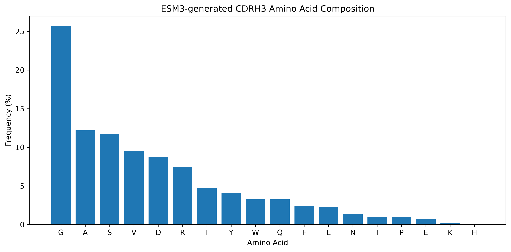
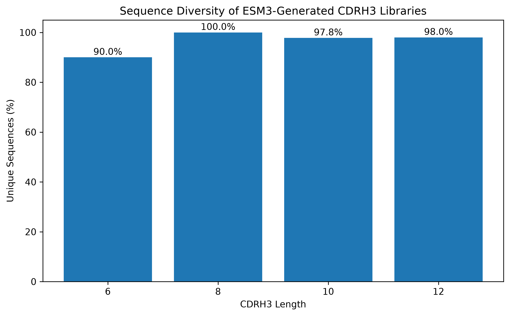

# ESM3 Antibody CDR Design

## Project Overview

This project explores the use of ESM3, a protein foundation model, for antibody CDRH3 sequence generation and redesign. The goal is to evaluate whether ESM3 can generate biologically plausible CDRH3 variants and to analyze the resulting sequence diversity and amino acid composition.

---

## Motivation

Antibody CDRH3 loops play a central role in antigen recognition and often contribute significantly to binding specificity and affinity. Recent protein language models provide an opportunity to explore antibody sequence space computationally. This project investigates whether ESM3 can generate diverse CDRH3 candidates while maintaining antibody-like sequence characteristics.

---

## Workflow

```text
Mask CDRH3
      ↓
Generate Sequences with ESM3
      ↓
Extract Generated CDRH3
      ↓
Sequence Analysis
      ↓
Therapeutic Antibody Redesign
```

---

## Experimental Design

### Input

```text
TAVYYC______WGQGTLVTVSS
```

### Output

```text
TAVYYCAAGTSIWGQGTLVTVSS
```

CDRH3 lengths of 6, 8, 10, and 12 amino acids were evaluated. Fifty sequences were generated for each length, resulting in a library of 200 CDRH3 variants.

---

## Example Results

| Mask Length | Generated CDRH3 |
| ----------- | --------------- |
| 6           | AAGTSI          |
| 8           | ARWDDTWY        |
| 10          | AARSGSGSWV      |
| 12          | ARRDGGGGGFDV    |

---

## Amino Acid Composition



Analysis of 200 generated CDRH3 sequences revealed a strong enrichment of glycine (25.7%), followed by alanine (12.2%) and serine (11.7%).

Aromatic residues such as tyrosine and tryptophan were also observed, while no cysteine residues were generated within the designed regions.

---

## CDRH3 Diversity Analysis



Across all tested loop lengths, ESM3 generated highly diverse CDRH3 libraries with unique sequence rates ranging from 90% to 100%.

The highest diversity was observed for 8-amino-acid loops, while all longer loop lengths maintained greater than 97% uniqueness. These results suggest that ESM3 explores a broad sequence space even when constrained within a fixed antibody framework.

---

## Therapeutic Antibody CDRH3 Redesign

To explore a more biologically relevant application, I extended the workflow from antigen-free CDRH3 generation to scaffold-constrained antibody redesign.

The heavy-chain framework of atezolizumab, a clinically approved anti-PD-L1 antibody, was used as a fixed scaffold. The native CDRH3 sequence:

```text
RHWPGGFDY
```

was masked and regenerated using ESM3 while preserving the surrounding antibody framework.

### Example Generated Variants

| Original CDRH3 | ESM3-Generated CDRH3 |
| -------------- | -------------------- |
| RHWPGGFDY      | GDGYGYFDY            |
| RHWPGGFDY      | GGYYYSMDY            |
| RHWPGGFDY      | GGYGFALDY            |
| RHWPGGFDY      | GGYYYGFDY            |
| RHWPGGFDY      | DDYYYGMDY            |

### Observations

Several notable sequence patterns emerged from the generated variants:

* Glycine (G) and tyrosine (Y) were strongly enriched across the redesigned CDRH3 sequences.
* Most generated variants preserved the original loop length of 9 amino acids.
* Multiple candidates retained the C-terminal `DY` motif, suggesting that ESM3 recognized local sequence context within the antibody framework.
* The original `RHWP` motif was not preserved, indicating that ESM3 explored alternative sequence solutions while maintaining overall antibody-like characteristics.

This experiment demonstrates how a protein foundation model can be applied to therapeutic antibody scaffolds to generate diverse CDRH3 candidates. Antigen-specific binding cannot be inferred directly from sequence generation and would require downstream structural modeling and experimental validation.

---

## Key Observations

* ESM3 successfully generated diverse CDRH3 sequences across multiple loop lengths.
* Generated libraries exhibited high diversity, with unique sequence rates ranging from 90% to 100%.
* Glycine-rich and tyrosine-rich motifs were frequently observed, consistent with characteristics of natural antibody repertoires.
* No cysteine residues were generated within the designed CDRH3 regions, reducing the risk of unintended disulfide bond formation.
* ESM3 successfully generated alternative CDRH3 candidates within the framework of a therapeutic anti-PD-L1 antibody.

---

## Future Work

* Structural filtering of ESM3-generated CDRH3 variants
* Antibody-antigen complex prediction using Boltz-1
* Interface scoring and ranking of redesigned antibodies
* Developability assessment (aggregation, stability, and liability prediction)
* Expansion from scaffold-constrained redesign to antigen-aware antibody engineering

---

## Repository Structure

```text
README.md

scripts/
├── cdrh3_generation.py
├── generate_cdrh3_library.py
├── analyze_cdrh3_library.py
├── analyze_cdrh3_diversity.py
├── plot_aa_frequency.py
├── plot_cdrh3_diversity.py
└── generate_atezolizumab_cdrh3_variants.py

results/
├── esm3_cdrh3_library.csv
├── aa_frequency.csv
├── cdrh3_diversity_summary.csv
└── atezolizumab_cdrh3_variants.csv

images/
├── aa_frequency.png
└── cdrh3_diversity.png
```

---

## Author

Protein engineer with experience in antibody discovery, protein engineering, and AI-guided biologics development.
